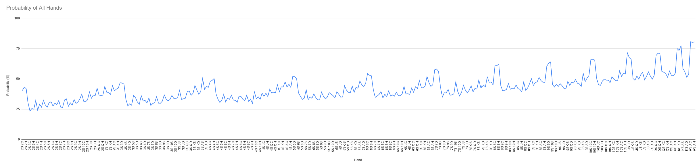

# PokerApplication
## A poker game

Console based java poker application.

Play poker through windows command prompt against AI opponents.

A seperate goal is to find out the probability each possible poker hand has to win if no player folds.

## Installation:

### For Windows
  1. Download the build folder from the project.
  2. Open command prompt
  3. To run the program type "java -jar 'path/PokerApp.jar'", where path = the path name for where you downloaded the build folder.
  4. To play a game, enter the command 'p'
  
## How it Works

  
## Goal
The goal of this program is to find out likelihood each hand has to win where every player plays till the end of the round. To find the probabilities of each hand would help a player decide how good theie hand is before the flop.

## Hypothesis
Each pair should have a better chance of winning and the higher the card value the better chance of winning. Also when a player has cards of the same suit they should have a slightly better chance of winning.
  
## Graph of the probabilities

## Explaining the Data
The worst starting hand is a 2 and a 3, which has around 24% chance of winning. The best starting hand is two Aces, which has around 80% chance of winning. 

There is a large increase in the chance of winning when the player has a pair in their starting hand, around 20% higher for each hand. This is because they start with a hand better than a high card, also they have a higher chance to get a three of a kind or a full house.

The probability of a hand winning increases as the value of the cards go up as the value of the cards go up. This is just common sence since you would have a better chance of winning if you had good cards.

There are also small spikes when a hand has two cards with the same suit, about a 5% increase. This is because the player has a better chance of having a flush draw.

You should put a bet in if you have a pair in your hand and you should not bet much money in if both of your cards are less than a 10, however if you have cards with the same suit then you may think about betting more money than otherwise. I didn't see any obvious increase for a straight draw, most likely because it is not a big enough increase in winning than having better cards.

James Bird-Sycamore
Last Updated: 18/04/2020
